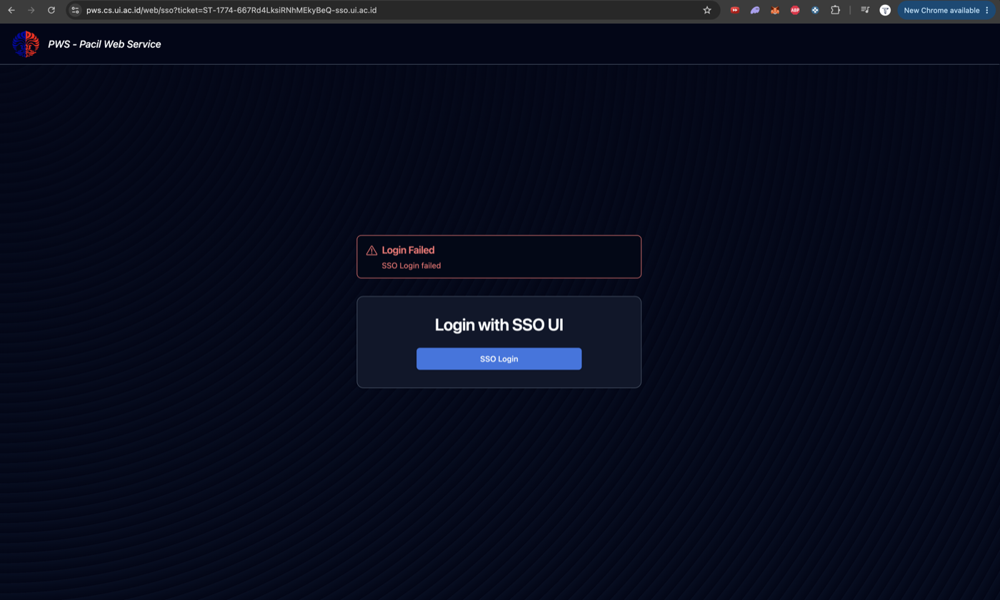

Name : Tahir Ahmad
NPM : 2606816466
Class : PBP

# Personal Portfolio

Personal portfolio website for Platform-Based Programming (CSGE602022) at Universitas
Indonesia, odd semester 2026/2027. A Django project that serves a static "About Me" page
built with plain HTML5 and CSS3.

## Setup

```
python3 -m venv env
source env/bin/activate        # Windows: env\Scripts\activate
pip install -r requirements.txt
python manage.py migrate
python manage.py runserver
```

The page is then available at http://localhost:8000/.

## Weekly progress

* **Tutorial 0**: Git repository, virtual environment and Django project setup.
* **Tutorial 1**: Renamed the project package to `portofolio`, added the `landing_page`
  view, URL routing, template and static file configuration plus the "About Me" hero
  section in HTML5 and CSS3.
* **Assignment 1**: Added Experience, Skills and Education sections to the same page,
  each with its own CSS rules (timeline layout, responsive skill grid, hover states).
* **Tutorial 2**: Created the `main` application and the `Experience` model, moved the
  profile data out of the template into a view context and added a separate experience
  page at `/experience/` that renders model data. Routing goes through `main/urls.py`
  and six unit tests cover both pages and the model.

## Deployment (PWS) not completed

The PWS deployment step of Tutorial 1 could not be completed. Logging in at
pws.cs.ui.ac.id fails with "Login Failed, SSO Login failed", even though the UI SSO
authentication itself succeeds and the callback URL contains a valid service ticket.
See the screenshot below.



I am an exchange student and appear not to have access to PWS. Another international
student reported the same problem and was told that this step can be skipped. Everything
else in Tutorial 0 and Tutorial 1 is complete and runs locally. My SSO username is
tahir.ahmad.

### Assignment 1

1. **Did you use semantic HTML5 elements and how did they help?**

   Yes. The page is split into four `section` elements (about, experience, skills,
   education) and each one has an id that the `nav` links to, so the navigation needs no
   extra wrapper elements around it. Every entry in Experience and Education is an
   `article`, because each entry stands on its own and would still make sense if you
   pulled it out of the page. The skills are a `ul` since they are a list of items of
   equal weight, while the NPM and Program pair in the hero is a `dl`, because those are
   labels with values and not a list. Around all of that sit `header`, `main` and
   `footer`. What this gave me in practice was less markup and clearer CSS, since a
   selector like `.timeline .entry` describes the real structure of the page instead of
   a chain of nameless `div` elements. The anchor navigation came for free from the
   section ids. It also means a screen reader can announce the parts of the page rather
   than reading it as one long block. I did not use `aside`, because that element is
   meant for content that sits beside the main topic. On a page this short nothing
   is really secondary. Every section is part of the same statement about who I am, so
   adding an `aside` just to have used the tag would have been the wrong markup for what
   the content actually is.

2. **What layout challenges came up in making it responsive?**

   The hero was the hardest part. On desktop it is a CSS Grid with `grid-template-areas`
   where the photo takes a column that spans two rows next to the name and the details,
   and that arrangement falls apart as soon as the screen gets narrow. The media query
   redefines the areas as a single column and reorders them to identity, then photo,
   then details. That reordering was the real decision, because if the areas were simply
   stacked in source order the long bio paragraph would push the photo far down the
   page. The name and the face are what identify the page, so they belong first with
   the supporting text after them. For the skills I avoided a second breakpoint
   completely by using `repeat(auto-fit, minmax(240px, 1fr))`, which lets the browser fit
   as many 240px columns as there is room for and gives three columns on desktop and one
   on a phone without me naming either number anywhere. The header broke once the
   navigation grew from two links to five, since at 375px they no longer fit on one line
   next to my name, so the header stacks vertically and the nav is allowed to wrap. The
   photo needed a max width on mobile as well, because at the full container width it
   filled most of the screen before any text became visible. The rule I used for all of
   these was to ask what a visitor needs to see first on a small screen: identity before
   detail. Anything that is only decoration, like the offset colour block behind the
   photo, is allowed to shrink.

3. **What are the limits of a purely static page and what would you add next?**

   Everything is written directly into the template, so adding one job or one skill means
   editing HTML and making a commit. That does not scale. It also means a content
   change looks exactly like a code change in the git history. Nothing can be filtered or
   sorted, every visitor gets the identical page and nobody can leave anything behind,
   since the only way to contact me is a mailto link that only works if the visitor has a
   mail client set up. The next thing I would want is to move the content into Django
   models, one for experience entries, one for skills and one for projects, then let the
   view pass them to the template as querysets. The page would then be generated from
   data, the admin interface would become the tool I edit it with and adding an entry
   would no longer require a deployment. After that a contact form, because it is the
   piece a portfolio actually needs and it requires exactly the request handling and
   storage that a static page cannot give you.

## Use of AI

The reflective answers in this README were rewritten with AI support so they are easier
to read. I asked for simpler wording instead of the vocabulary I picked up in my master's
programme, since this is a bachelor level course. The design decisions described in the
answers are my own.
